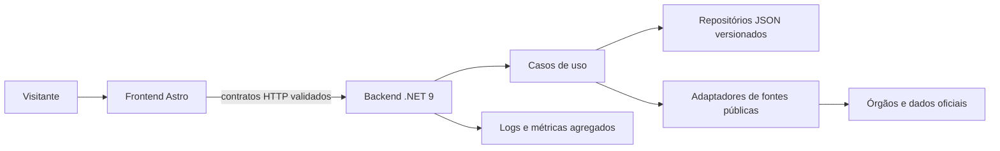

# GOBPS — documentação pública

Documentação de arquitetura, qualidade e governança do **GOBPS — Guide of Brazilian Political System**.

O GOBPS é um guia aberto sobre instituições, representantes, eleições, conceitos e participação pública no Brasil. Este repositório existe para tornar as decisões técnicas e editoriais auditáveis sem expor o código-fonte, credenciais, infraestrutura operacional ou dados pessoais.

## O que este repositório contém

- Arquitetura e fronteiras entre frontend, backend e fontes públicas.
- Decisões de engenharia, contratos de dados, testes, observabilidade e resiliência.
- Critérios de fontes, privacidade, acessibilidade e publicação.

## O que ele não contém

- Código-fonte do GOBPS, segredos, variáveis de ambiente ou endereços administrativos.
- Dados pessoais de visitantes, mensagens recebidas ou logs operacionais.
- Cópias integrais de fontes de terceiros, imagens sem licença inequívoca ou dados eleitorais não validados.

## Visão de arquitetura

O frontend entrega jornadas editoriais rápidas e acessíveis. O backend concentra regras, contratos estáveis, credenciais, cache e a integração responsável com fontes públicas. Fontes externas não são chamadas diretamente pelo navegador.

## Princípios

1. **Fonte antes de aparência.** Informação factual precisa de origem verificável, data e contexto.
2. **Sem dados fictícios em produção.** Ausência ou indisponibilidade é comunicada de forma honesta.
3. **Privacidade por padrão.** Coletar o mínimo necessário, não registrar conteúdo de formulários em telemetria e não expor infraestrutura sensível.
4. **Interfaces explicativas.** A interação ajuda a compreender uma instituição, não substitui a fonte oficial nem a leitura crítica.
5. **Qualidade como fluxo.** Alterações passam por contratos, testes, acessibilidade, responsividade e revisão editorial antes de produção.

## Mapa da documentação

- [Arquitetura](docs/architecture.md)
- [Interface e experiência](docs/frontend.md)
- [Qualidade e ciclo de entrega](docs/quality.md)
- [Governança de dados e privacidade](docs/governance.md)
- [Decisões registradas](docs/decisions/)
- [Política de segurança](SECURITY.md)

## Estado do projeto

O GOBPS é um projeto em evolução. A documentação descreve decisões vigentes e será atualizada quando uma alteração tiver sido revisada e publicada. Documentação pública não substitui a fonte institucional de cada dado exibido no guia.

## Licença da documentação

Salvo indicação diversa, os textos e diagramas originais deste repositório estão sob [Creative Commons Atribuição–SemDerivações 4.0 Internacional](LICENSE).
