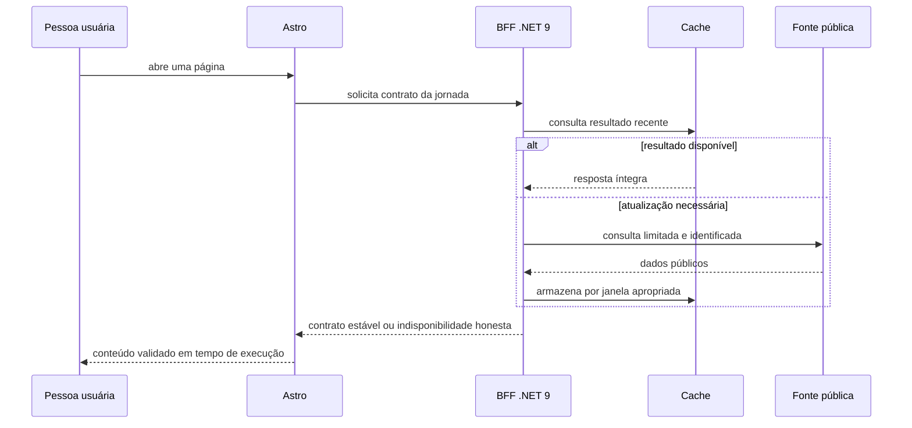

# Arquitetura

## Limites do sistema

O frontend em Astro é responsável por composição, acessibilidade, navegação e interações locais. O backend em .NET 9 é um Backend for Frontend (BFF): recebe as chamadas do site, aplica regras de aplicação, estabiliza contratos e conversa com fontes externas. Dados editoriais versionados permanecem no backend até existir um repositório de dados apropriado.

## Camadas do backend

| Camada | Responsabilidade |
| --- | --- |
| Controllers | Binding HTTP, status e Problem Details; não contêm regra de negócio. |
| Use cases | Orquestração de uma jornada e resultados independentes do protocolo. |
| Services | Regras especializadas, cache e portas para capacidades externas. |
| Repositories e clientes | Leitura de JSON, escrita editorial controlada e adaptadores de provedores. |
| Models | Contratos e entidades sem dependência de ASP.NET ou HTTP. |

As dependências apontam para dentro. Um controller não acessa arquivo, relógio ou cliente externo diretamente.

## Contratos

O BFF é a fronteira de contrato. O Astro valida respostas em tempo de execução com schemas; campos indispensáveis não são convertidos por coerção insegura. Mudanças incompatíveis exigem versionamento explícito ou adaptação coordenada, acompanhada de testes de contrato.

## Dados e proveniência

Repositórios isolam os arquivos JSON editoriais versionados até que exista uma fonte de dados adequada para substituí-los. Integrações públicas passam por adaptadores próprios, que registram a fonte, a data de consulta e a finalidade quando aplicável. Um link ou crédito não substitui a avaliação de licença ou de termos de uso.

## Organização do código

Controllers são organizados por jornada funcional e mantidos pequenos: fazem binding, chamam um caso de uso e traduzem o resultado para HTTP. Casos de uso orquestram uma operação. Serviços concentram regras especializadas e integrações. Repositórios isolam leitura de JSON e escritas editoriais controladas. Essa divisão aplica responsabilidade única e inversão de dependência sem criar módulos vazios.

O projeto permanece em um assembly enquanto isso mantém o custo de manutenção baixo. As fronteiras já permitem separar domínio, aplicação, infraestrutura e API caso o crescimento torne essa divisão necessária.

## Resiliência e desempenho

- Clientes HTTP têm timeout, retry limitado e cancelamento propagado.
- `HttpClientFactory` centraliza clientes e políticas de transporte; as dependências de infraestrutura entram por injeção de dependência, em vez de serem criadas pelos controllers.
- Endpoints idempotentes usam cache de curta ou média duração quando a origem permite.
- Atualizações de catálogos custosos podem iniciar em segundo plano após a aplicação estar saudável; uma falha nunca bloqueia a aplicação inteira.
- Dados que exigem resposta completa não recebem estimativas nem valores substitutos.
- Chamadas externas são limitadas e identificadas para reduzir risco de sobrecarga ou bloqueio de provedores.

## Respostas HTTP e falhas esperadas

Controllers cuidam de binding, códigos de status e `Problem Details`. Regras de negócio, acesso a arquivo, relógio e chamadas a provedores ficam fora dessa camada. Assim, uma indisponibilidade de fonte pode ser comunicada com clareza, sem confundir erro técnico, ausência de dado e validação inválida.
